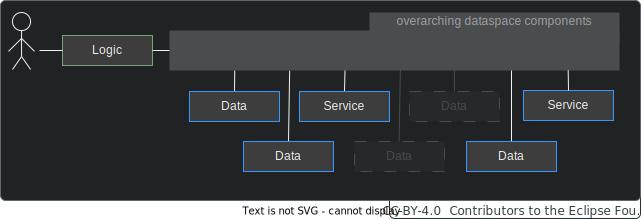
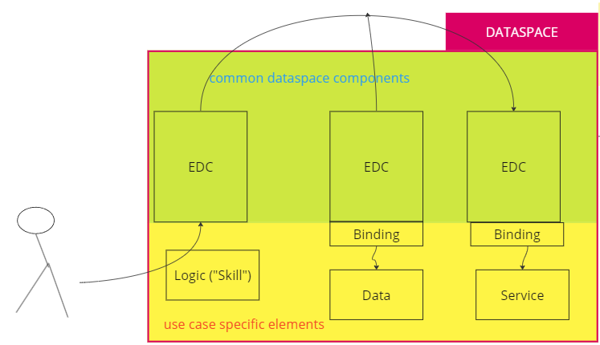

<!-- DEACTIVATED FOR DOCUSAURUS FROM HERE -->

[Behaviour Twin KIT](../overview.md) > [Adoption View](./overview.md) > Architecture

# Architecture

<!-- DEACTIVATED FOR DOCUSAURUS TO HERE -->

<!-- VARIANT FOR DOCUSAURUS FROM HERE

  

  

  

Behaviour Twin KIT
  

VARIANT FOR DOCUSAURUS TO HERE -->

<!-- DEACTIVATED FOR DOCUSAURUS FROM HERE -->

  

  

  

Behaviour Twin KIT
  

<!-- DEACTIVATED FOR DOCUSAURUS TO HERE -->

<!-- END OF HEADER -->

## BASIC ARCHITECTURE

### OVERVIEW

A use case consists of data and calculation services. In addition, a logic is required,
that defines how data and services must interact to produce the desired result.
This logic is called "skill". It must be invoked directly or indirectly by the consumer.

Data and services are federated over the dataspace:

A use case may consist of multiple data source and calculation service:

### ROLES

Each participant in a Behaviour Twin use cases applies to one or more of the following roles:

- **consumer** (result requester)
- **skill provider** (provider of the use case logic)
- **data provider** (provider of usage data, likely an OEM)
- **delegator** (delegates data to calculation services, likely a supplier of a component that
  is assembled of subcomponents which are providing calculation services)
- **calculation service provider** (likely a supplier of a part or component)

## BUSINESS PROCESS

one up/down

Info: component "owner" is also usage data owner

consumer invokes skill (at it's EDC)

  -> skill goes to the component+data owner

  -> skill resolves component instance for given parameters (e.g. VIN, serial number, ...)

  -> skill resolves appropriate service (and it's provider) with desired result type for component

  -> skill fetches required input data

  -> skill invokes service with fetched data

  -> skill transfers result to consumer
  
  -> result is transfered back to consumer.

federated catalog / ontology

{TODO}{sequence diagram, ...}

## DETAILED ARCHITECTURE

### BUILDING BLOCK VIEW

{TODO}

### COMPONENTS

#### Behaviour Twin Components

|Subsystem|Description|
|---------|-----------|
|Data Consuming App| This component is the app that is hosted at the Consumer and provides the end user interface. The end user can enter a vehicle identifier number (VIN) and gets back a calculated RuL value.   The returned value from the calculation services is SAMM specified. The app can provide another representation.|
|Loading Data | A data source at the Data Provider that provides the loading data and other vehicle data that are needed for the RuL calculation.   It can be accessed by the knowledge agent via data bindings.|
|RuL Service| A RuL calculation service at the Service Provider. It accepts input data from the Data Provider, calculates the RuL value and returns it.|

#### Knowledge Agent components

|Subsystem|Description|
|---------|-----------|
|Matchmaking Agent|This component supports SparQL to traverse the federated data space as a large data structure. It interacts with the EDC. <UL><LI>The provider's Matchmaking Agent will be activated by its EDC. Therefore, the EDC must offer a Graph Asset (variant of ordinary data assets in the Catena-X EDC standard).</LI><LI> The consumer's Matchmaking Agent interacts with its EDC to negotiate and perform the transfer of Sub-Skills to other dataspace participants.</LI></UL> The Matchmaking Agents are matching the (sub)graphs and negotiate appropriated graph assets with the partner EDCs.|
|Binding Agent| The Binding Agent is a restricted version of the Matchmaking Agent (subset of OWL/SparQL, e.g., without federation) which is just focused on translating Sub-Skills of a particular business domain (Bill-Of-Material, Chemical Materials, Production Sites, etc.)  into proper SQL- or REST based backend system calls.   Implementation details: For data bindings, OnTop is used. For service bindings, RDF4J is used.|
|Ontology|The ontology is a formal representation of knowledge that captures concepts, relationships, and properties. It allows a shared understanding and reasoning about the respective domain.   It must be hosted in a way that all participants can access it. Currently, the ontology is hosted at GitHub.|
|Skill/Sub-Skill| The Skill describes, what to do (which data have to be connected, transferred and so on).|

#### CATENA-X CORE SERVICES (except Knowledge Agent components)

|Subsystem|Description|
|---------|-----------|
|Eclipse Dataspace Components (EDC)|The Connector of the Eclipse Dataspace Components provides a framework for sovereign, inter-organizational data exchange. It implements the International Data Spaces standard (IDS) as well as relevant protocols associated with GAIA-X. The connector is designed in an extensible way in order to support alternative protocols and integrate in various ecosystems.|

## USE CASE TYPES

In general view, use cases can be categorized dependent on specific criteria:

### GENERAL USE CASE TYPES

- Data owner is also consumer and wants result (must implement logic),  starts logic.
- External consumer wants result (must implement logic), first address is data owner.
- Third party implements logic and offers it to consumer.

#### Origin of query

- Usage data owners (like OEMs) query a calculation services of IP owners (like suppliers) along the supplier chain.
- Service providers (like automobile clubs) gather data or insights along the supplier chain in behalf of their customers.

#### Origin of data-processing logic

- The querying party knows how to process data, e.g. how to accumulate acquired data.
- The data processing party knows how to process data, e.g. which simulation model to chose.
- A third party offers logic for processing data.

{TODO}{images/roles}

<!-- START OF FOOTER -->

<!-- DEACTIVATED FOR DOCUSAURUS FROM HERE -->

| Previous | Next |
| -------- | ---- |
| [Introduction](./introduction.md) | [Knowledge Agent](./knowledge-agent.md) |

<!-- DEACTIVATED FOR DOCUSAURUS TO HERE -->
