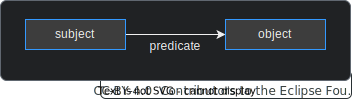

---
id: knowledge-agent
title: Knowledge Agent
description: Behaviour Twin KIT
sidebar_position: 6
---

  

  

  

Behaviour Twin KIT
  

## KNOWLEDGE GRAPH BASICS

The Knowledge Agent is a set of federated components that are used to reason over knowledge graphs. For detailed information, see the [Agents KIT](../../knowledge-agents/adoption-view/intro).

Knowledge graphs are buildup of semantic triplets. Those triplets are consisting of a subject, a predicate and an object. Subject and object are nodes, the predicate is a unidirectional edge (a relation) between them:

For knowledge graphs, there exists a model (ontology) and instances of 

Ontology / instance
[https://w3id.org/catenax ](https://w3id.org/catenax)

Ontologies support inheritance.

Current ontologies, extensions for test cases
You can use/share a private extension to an ontology. In this case, you have to provide the ontology with the agent's configuration (only statically due to security reasons). {KA} -> private GitHub (KA-config!)

Credentials?

https://github.com/eclipse-tractusx/knowledge-agents

Common/cx ontologies {TODO}
Use-case ontologies. {TODO}
Experts-group? Official extensions, development, ...

Common ontology references domain ontologies -> private extension?
matchmaking remoting binding provisioning

 (subject --predicate-> object),
where subject and object are nodes, the predicate is a unidirectional edge.
All nodes are object instances, and the edges between them are their relations. For more information, see [W3C Resource Description Framework (RDF)](https://www.w3.org/RDF/). Object types and relations are formally defined within ontologies.

Subjects and objects may not be real objects but conceptual ones.

{TODO}{Simple description, from RuL KIT}

## ARCHITECTURE OF KNOWLEDGE AGENT

{TODO}{Diagram/drawing} Binding-agents, matchmaking, graph-assets, ...
{LINK}{KA-KIT}

## BINDINGS

Extra layer of security. Map relational data to graphs.

## TEST

Currently, there is no ready-to-use test environment. If you want to test your use case,
you still have options:

- Have a look at the [Agents KIT](../../knowledge-agents/adoption-view/intro), maybe there is already something regarding testing.
- Do research at your operating company's website or contact them.
- Build up your own test environment. As a basis, you could use the official Tractus-X [MXD test environment on GitHub ](https://github.com/eclipse-tractusx/tutorial-resources). Unfortunately, the Knowledge Agent components were not included into the MXD deployment scripts until release of the current KIT version.
