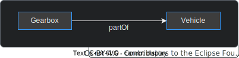
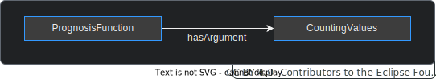

<!-- DEACTIVATED FOR DOCUSAURUS FROM HERE -->

[Behaviour Twin KIT](../overview) > [Adoption View](./overview) > Knowledge Agent

# Knowledge Agent

<!-- DEACTIVATED FOR DOCUSAURUS TO HERE -->

<!-- VARIANT FOR DOCUSAURUS FROM HERE

  

  

  

Behaviour Twin KIT
  

VARIANT FOR DOCUSAURUS TO HERE -->

<!-- DEACTIVATED FOR DOCUSAURUS FROM HERE -->

  

  

  

Behaviour Twin KIT
  

<!-- DEACTIVATED FOR DOCUSAURUS TO HERE -->

<!-- END OF HEADER -->

## KNOWLEDGE GRAPH BASICS

The Knowledge Agent is a set of federated components that are used to reason over knowledge graphs.
For detailed information, see the [Agents KIT](../../knowledge-agents/adoption-view/intro).

Knowledge graphs are build up of semantic triplets.
Those triplets are consisting of a subject, a predicate and an object. Subject and object
are nodes, the predicate is an unidirectional edge (a relation) between them:

For knowledge graphs, there exists a model (ontology) and instances of 

Ontology / instance

Ontologies support inheritance.

Current ontologies, extensions for test cases
You can use/share a private extension to an ontology. In this case, you have to provide the ontoloty with the agent's configuration (only statically due to security reasons). {KA} -> private GitHub (KA-config!)

Credentials?

https://github.com/eclipse-tractusx/knowledge-agents

Common/cx ontologies {TODO}
Use-case ontologies. {TODO}
Experts-group? Offical extensions, development, ...

Common ontology references domain ontologies -> private extension?
matchmaking remoting binding provisioning

 (subject --predicate-> object),
where subject and object are nodes, the predicate is a unidirectional edge.
All nodes are object instances, and the edges between them are their relations.
For more information, see [W3C Resource Description Framework (RDF)](https://www.w3.org/RDF/).  
Object types and relations are formally defined within ontologies.

Subjects and objects may not be real objects but conceptual ones.

{TODO}{Simple description, from RuL KIT}

## ARCHITECTURE OF KNOWLEDGE AGENT

{TODO}{Diagram/drawing} Binding-agnets, matchmaking, graph-assets, ...
{LINK}{KA-KIT}

## BINDINGS

Extra layer of security. Map relational data to graphs.

## TEST

Currently, there is no ready-to-use test environment. If you want to test your use case,
you still have options:

- Have a look at the [Agents KIT](../../knowledge-agents/adoption-view/intro),
  maybe there is already something regarding testing.
- Do research at your operating company's website or contact them.
- Build up your own test environment. As a basis, you could use the official Tractus-X
  [MXD test environment on GitHub](https://github.com/eclipse-tractusx/tutorial-resources)
  .
  Unfortunately, the Knowledge Agent components were not included into the MXD deployment
  scripts until release of the current KIT version.

<!-- START OF FOOTER -->

<!-- DEACTIVATED FOR DOCUSAURUS FROM HERE -->

| Previous | Next |
| -------- | ---- |
| [Architecture](./architecture) | [Versioning](./versioning) |

<!-- DEACTIVATED FOR DOCUSAURUS TO HERE -->
