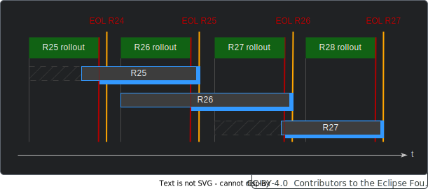

<!-- DEACTIVATED FOR DOCUSAURUS FROM HERE -->

[Behaviour Twin KIT](../overview.md) > [Adoption View](./overview.md) > Versioning

# Versioning

<!-- DEACTIVATED FOR DOCUSAURUS TO HERE -->

<!-- VARIANT FOR DOCUSAURUS FROM HERE

  

  

  

Behaviour Twin KIT
  

VARIANT FOR DOCUSAURUS TO HERE -->

<!-- DEACTIVATED FOR DOCUSAURUS FROM HERE -->

  

  

  

Behaviour Twin KIT
  

<!-- DEACTIVATED FOR DOCUSAURUS TO HERE -->

<!-- END OF HEADER -->

## CATENA-X RELEASES

In Catena-X, breaking changes will only be allowed in main releases. Main releases
are planned to happen once a year. If your use case is not affected by breaking changes,
you may not need to release a new main version.

Since not all participants can update all their components at the same time, there will be
a transition period. There are three dates within this periode that must be considered:

- **Start of rollout:** From this date on, the new version can be provided/supported.
  Once it is released, it must not be revoked.
- **End of rollout (deadline):** Until this date, the new version must be provided/supported.
- **End of life:** Until this date, version must be supported. This date is not befor the
  rollout deadline of the following verson.

There may be a period of time where two versions are provided/supported in parallel:

The three dates may coincide on a date. In this case, start of rollout is on same date
as end of rollout of the previous version, and end of rollout is on same date as end of life
of the previous version:

It is always guaranteed that a version is provided/supported from end of rollout until
end of life.

 Take into account that other components (like your
own EDCs and your partners' components), may not be updated to their corresponding new
version before end of rollout. Therefore, you can only rely on the previous version.

This release procedure may affect you only if you have breaking changes within your
use cases, or the Knowledge Agent interface changes in a breaking way. In most cases,
the use case specific components are not affected.

## VERSIONING ASSETS

All EDC assets must be decorated by the `cx-common:version` within the `properties` list
of the asset definitions. This is required by the standard {TODO}. This applies to
graph assets (data and service binding assets) as well as to skill assets.

## ONTOLOGY CHANGES

In most cases, ontologies are not alternated, but extended. The meaning of nodes/edges
must not change.

New service or data types must have new types within the ontologies.

 If an ontology gets extended, not all users
may be aware of this extension. As a consumer of data or services, you cannot expect
that all providers provide the correspondig data until next main release.
If required, you may establish a appropriate mechanism in your use case for informing
your partners and requiring them to provide the extended data.

## DATA AND SERVICE VERSIONS

Versioning of services, but also data is especially helpful if you want to harmonize
versions within a use case. The attribute `cx-common:version` within the `properties`
list of the asset definitions can be used for this purpose. Using semantic versioning,
the feature version number can be harmonized by all participants (e.g. by agreements or
standards).

A second option would be an extension of the corresponding ontologies and taxonomies.
Then, the version information can be a part of the SHACL description in the graph assets.

It's up to the use case to handle the versioning. In skills, both options can be
used to determine the desired data and service versions.

<!-- START OF FOOTER -->

<!-- DEACTIVATED FOR DOCUSAURUS FROM HERE -->

| Previous | Next |
| -------- | ---- |
| [Knowledge Agent](./knowledge-agent.md) | [To Be Considered](./to-be-considered.md) |

<!-- DEACTIVATED FOR DOCUSAURUS TO HERE -->
