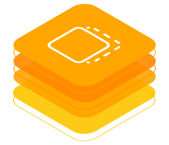

<!-- DEACTIVATED FOR DOCUSAURUS FROM HERE -->

Behaviour Twin KIT

<!-- DEACTIVATED FOR DOCUSAURUS TO HERE -->

<!-- VARIANT FOR DOCUSAURUS FROM HERE

BEHAVIOUR TWIN KIT

VARIANT FOR DOCUSAURUS TO HERE -->

<!-- DEACTIVATED FOR DOCUSAURUS FROM HERE -->

BEHAVIOUR TWIN KIT

<!-- DEACTIVATED FOR DOCUSAURUS TO HERE -->

<!-- END OF HEADER -->

Which problem this KIT solves;Hinweis auf Generalisierte Inhalte und existierende Use-Cases, Only Tractus-X-context

## PURPOSE

## CONTENTS

- [Change Log](changelog.md)
- [Adoption View](adoption-view/overview.md)
- [Development View](development-view/overview.md)
- [Use-Cases](use-cases/overview.md)

## NOTICE

<!-- START OF FOOTER -->

<!-- DEACTIVATED FOR DOCUSAURUS FROM HERE -->

| Previous | Next |
| -------- | ---- |
|  | [Change Log](changelog.md) |

<!-- DEACTIVATED FOR DOCUSAURUS TO HERE -->
