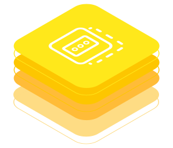

<!-- DEACTIVATED FOR DOCUSAURUS FROM HERE -->

[Behaviour Twin KIT](../../overview) > [Use Cases](../overview) > Health Indicator

# Health Indicator

<!-- DEACTIVATED FOR DOCUSAURUS TO HERE -->

<!-- VARIANT FOR DOCUSAURUS FROM HERE

Behaviour Twin KIT -- Health Indicator

VARIANT FOR DOCUSAURUS TO HERE -->

<!-- DEACTIVATED FOR DOCUSAURUS FROM HERE -->

Behaviour Twin KIT -- Health Indicator

<!-- DEACTIVATED FOR DOCUSAURUS TO HERE -->

<!-- END OF HEADER -->

## PURPOSE

Provide and get the health condition of technical systems.

## CONTENTS

- [Change Log](./changelog)
- [Adoption View](adoption-view/overview)
- [Development View](development-view/overview)

<!-- START OF FOOTER -->

<!-- DEACTIVATED FOR DOCUSAURUS FROM HERE -->

| Previous | Next |
| -------- | ---- |
| [Test](../rul/development-view/test) | [Change Log](./changelog) |

<!-- DEACTIVATED FOR DOCUSAURUS TO HERE -->
