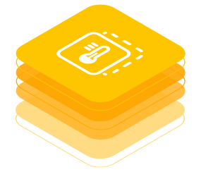

<!-- DEACTIVATED FOR DOCUSAURUS FROM HERE -->

[Behaviour Twin KIT](../../overview.md) > [Use-Cases](../overview.md) > Remaining useful Life

# Remaining useful Life

<!-- DEACTIVATED FOR DOCUSAURUS TO HERE -->

<!-- VARIANT FOR DOCUSAURUS FROM HERE

Behaviour Twin KIT -- Remaining useful Life

VARIANT FOR DOCUSAURUS TO HERE -->

<!-- DEACTIVATED FOR DOCUSAURUS FROM HERE -->

Behaviour Twin KIT -- Remaining useful Life

<!-- DEACTIVATED FOR DOCUSAURUS TO HERE -->

<!-- END OF HEADER -->

RuL-KIT-logo?

## CONTENTS

- [Change Log](changelog.md)
- [Adoption View](adoption-view/overview.md)
- [Development View](development-view/overview.md)

<!-- START OF FOOTER -->

<!-- DEACTIVATED FOR DOCUSAURUS FROM HERE -->

| Previous | Next |
| -------- | ---- |
| [Use-Cases](../overview.md) | [Change Log](changelog.md) |

<!-- DEACTIVATED FOR DOCUSAURUS TO HERE -->
